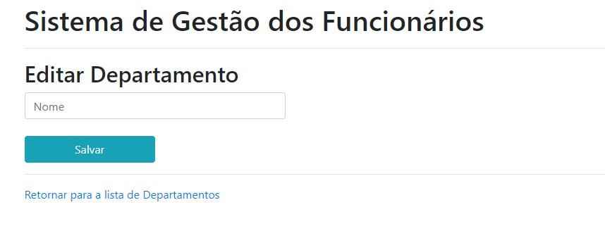

# Sobre o Projeto

O Projeto foi desenvolvido com o objetivo de gerenciar funcionários de uma empresa. Há basicamente 3 telas principais: Funcionários, Cidades e Departamentos.

## Telas

### Listar Funcionário
#### Funcionalidades
- Botão para Adicionar um Funcionário
- Exibir, Excluir e Alterar Funcionários
- Links para Cidades e Departamentos

### Adicionar / Alterar Funcionário
#### Funcionalidades
- Campos para Nome, Email e Telefone
- Dropdowns referenciados as entidades 'Cidades' e 'Departamentos'. Só serão exibidos dados que estão cadastrados no banco.
- Essa página é reutilizada, ou seja, eu utilizo o mesmo layout tanto para adicionar, quanto para editar. A diferença é que para editar eu seleciono baseado no 'Id'
- Link para voltar para a Listagem de Funcionários cadastrados

### Listar Cidades
#### Funcionalidades
- Botão para Adicionar uma Cidade
- Exibir, Excluir e Alterar Cidades
- Link para Funcionários

### Adicionar / Alterar Cidade
#### Funcionalidades
- Campos para Nome e Código
- Essa página é reutilizada, ou seja, eu utilizo o mesmo layout tanto para adicionar, quanto para editar. A diferença é que para editar eu seleciono baseado no 'Id'
- Link para voltar para a listagem das Cidades cadastradas

### Listar Departamentos
#### Funcionalidades
- Botão para Adicionar um Departamento
- Exibir, Excluir e Alterar Departamentos
- Link para Funcionários

### Adicionar / Alterar Departamento
#### Funcionalidades
- Campos para Nome do departamento
- Essa página é reutilizada, ou seja, eu utilizo o mesmo layout tanto para adicionar, quanto para editar. A diferença é que para editar eu seleciono baseado no 'Id'
- Link para voltar para a listagem de Departamentos cadastrados

## Autor

- [@hitoshidevx](https://github.com/hitoshidevx)

